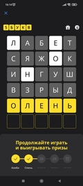

Тулза для помощи в отгадывании слов в игре "5 букв" от Тинькофф-банка.


Введите два-три слова из следующей последовательности в игре:

```text
смазь
флейц
будяк
выгон
причт
```

Программа выводит этот список по умолчанию при запуске без параметров (cargo run --bin main).

Результат передайте в аргументах tinkoff-guess-game-helper, н-р:

```shell
cargo run --bin main ^с^м=а^з^ь ^ф^л?е^й^ц
```

В примере в слове "смазь" буква "а" желтая (есть в слове и находится на своем месте),

в слове "флейц", что бы это ни значило, буква "е" белая (есть в слове не на своем месте).

Остальные буквы серые - нет в словах.

При 3 попытках (три слова в аргуменах) вероятность угадывания почти 100%.

Не ломайте голову! Хороших призов!

* Для желтой буквы укажите префикс `y` or `=`.
* Для серой - `g`, or `^`.
* Дле белой - `w` or `?`.

Usage example:


